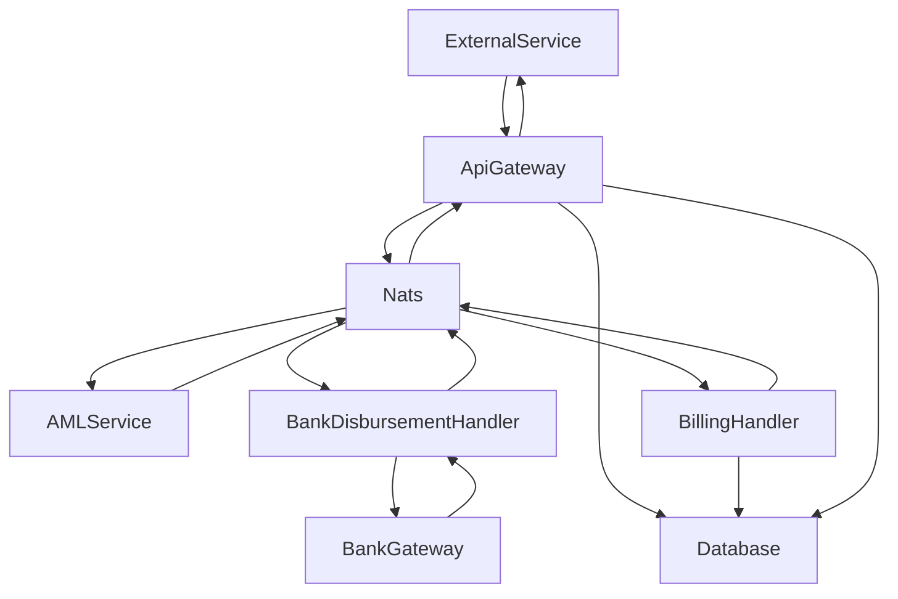

- **External Service**: Initiates a disbursement request through the API Gateway
- **Api Gateway**: Receives the transaction, publishes it to Nats with a `New` subject, and saves the transaction in the database
- **Nats**: Publishes the transaction to the AML Service
- **AML Service**: Performs real-time sanction screening and publishes the transaction to Nats with a `Compliance Checked` subject
- **Bank Disbursement Handler**: Receives the message, checks if the disbursement is possible (e.g., enough balance or limit), and pushes the transaction to the Bank Gateway for processing. When a response is received, it publishes the transaction to Nats with a `Processed` subject
- **Bank Gateway**: Processes the disbursement and sends a response back to the Bank Disbursement Handler
- **Billing Handler**: Receives the message, posts the transaction to the account statement, and publishes it to Nats
- **Api Gateway**: Receives the message, sends a callback request to the service, and updates the transaction in the database to completed
