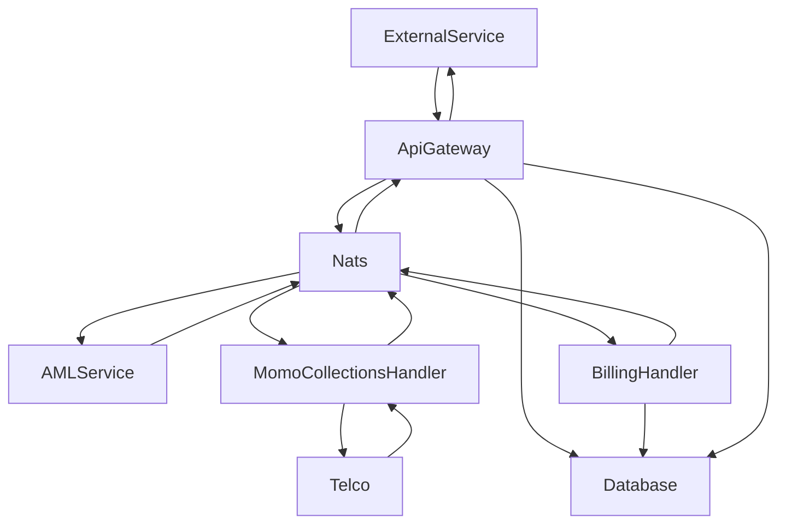

# Collection Transaction

## Mobile Wallet

- External Service Initiates a collection request through the API Gateway
- Api Gateway receives the transaction, publishes it to Nats with a New subject and then saves the transaction in the database
- AML Service handler receives the message from Nats, does a realtime santion screening and then publishes it to Nats with a Compliance Checked Subject
- The Momo Collections handler then receives the message and pushes it to the Telco for Authorization. When a response is received, the handler then publishes it to Nats with a Processed Subject
- The Billing Handler receives the message and posts the transaction to the account statement and then publishes it to Nats
- Api Gateway receives the message, and sends a callback request to the service and updates the transaction in the database to completed

## Bank Card

- External Service Initiates a collection request through the API Gateway
- Api Gateway receives the transaction, publishes it to Nats with a New subject and then saves the transaction in the database
- AML Service handler receives the message from Nats, does a realtime santion screening and then publishes it to Nats with a Compliance Checked Subject
- The Bank Card Collections handler then receives the message and pushes it to the Card Network for Authorization. When a response is received, the handler then publishes it to Nats with a Processed Subject
- The Billing Handler receives the message and posts the transaction to the account statement and then publishes it to Nats
- Api Gateway receives the message, and sends a callback request to the service and updates the transaction in the database to completed

# Disbursement Transaction

## Local Transaction

### Mobile Wallet

- External Service Initiates a disbursement request through the API Gateway
- Api Gateway receives the transaction, publishes it to Nats with a New subject and then saves the transaction in the database
- AML Service handler receives the message from Nats, does a realtime santion screening and then publishes it to Nats with a Compliance Checked Subject
- The Momo Disbursement handler then receives the message, checks if the disbursement is possible (ei. enough balance or limit) and pushes the transaction to the Telco/GHIPSS for processing. When a response is received, the handler then publishes it to Nats with a Processed Subject
- The Billing Handler receives the message and posts the transaction to the account statement and then publishes it to Nats
- Api Gateway receives the message, and sends a callback request to the service and updates the transaction in the database to completed

### Bank Account

- External Service Initiates a disbursement request through the API Gateway
- Api Gateway receives the transaction, publishes it to Nats with a New subject and then saves the transaction in the database
- AML Service handler receives the message from Nats, does a realtime santion screening and then publishes it to Nats with a Compliance Checked Subject
- The Bank Account Disbursement handler then receives the message, checks if the disbursement is possible (ei. enough balance or limit) and pushes the transaction to the GHIPSS for processing. When a response is received, the handler then publishes it to Nats with a Processed Subject
- The Billing Handler receives the message and posts the transaction to the account statement and then publishes it to Nats
- Api Gateway receives the message, and sends a callback request to the service and updates the transaction in the database to completed

## Remittance Transaction

### Mobile Wallet

- External Service Initiates a disbursement request through the API Gateway
- Api Gateway receives the transaction, publishes it to Nats with a New subject and then saves the transaction in the database
- AML Service handler receives the message from Nats, does a realtime santion screening and then publishes it to Nats with a Compliance Checked Subject
- The Momo Disbursement handler then receives the message, checks if the disbursement is possible (ei. enough balance or limit) and pushes the transaction to the Telco/GHIPSS for processing. When a response is received, the handler then publishes it to Nats with a Processed Subject
- The Billing Handler receives the message and posts the transaction to the account statement and then publishes it to Nats
- Api Gateway receives the message, and sends a callback request to the service and updates the transaction in the database to completed

### Bank Account

- External Service Initiates a disbursement request through the API Gateway
- Api Gateway receives the transaction, publishes it to Nats with a New subject and then saves the transaction in the database
- AML Service handler receives the message from Nats, does a realtime santion screening and then publishes it to Nats with a Compliance Checked Subject
- The Bank Account Disbursement handler then receives the message, checks if the disbursement is possible (ei. enough balance or limit) and pushes the transaction to the GHIPSS for processing. When a response is received, the handler then publishes it to Nats with a Processed Subject
- The Billing Handler receives the message and posts the transaction to the account statement and then publishes it to Nats
- Api Gateway receives the message, and sends a callback request to the service and updates the transaction in the database to completed
